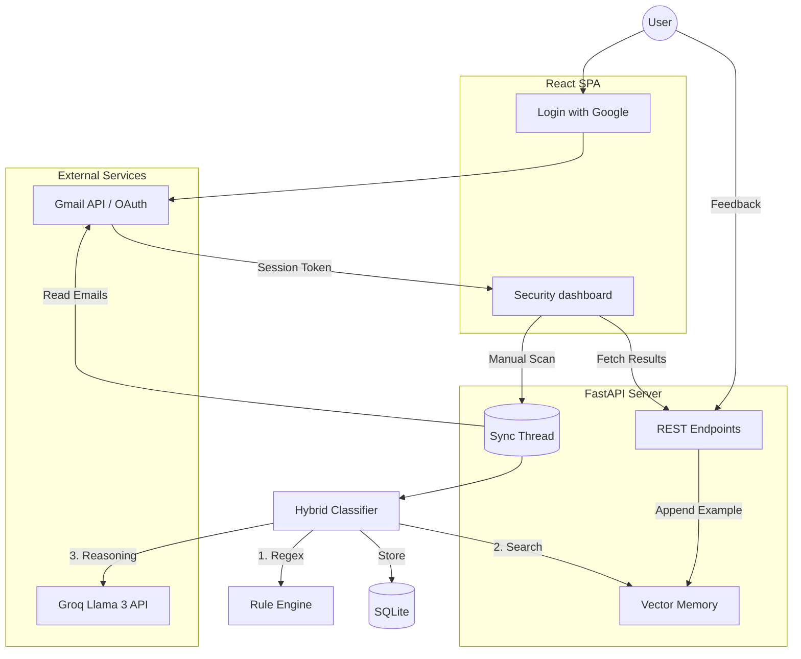

# Architecture Design: InkTrace Security Agent

## System Design Overview

InkTrace is designed as a **decoupled, event-driven agent** that prioritizes privacy and real-time learning. The core philosophy is to minimize LLM usage (to save costs) while maximizing context (to improve accuracy).

---

## 🧭 Data Flow Diagram

---

## 🛠️ Component Breakdown

### 1. The Hybrid AI Classifier
Unlike "dumb" scanners, InkTrace uses a tiered approach:
-   **Layer 1 (Linguistic)**: Matches against known phishing keywords and malicious URL patterns.
-   **Layer 2 (Semantic)**: Retrieves the top-K most similar examples from the user's past history using Cosine Similarity.
-   **Layer 3 (Cognitive)**: Uses a structured prompt to ask the LLM: *"Based on the rules found and these similar historical examples, is this email a threat?"*

### 2. The Vector Memory (RAG)
We use `fastembed` to turn text into 384-dimensional vectors. 
-   **Why local?** Privacy. We don't want to send private email snippets across the wire just to get an embedding.
-   **Active Learning**: Every "Relabel" action in the UI triggers a `jsonl` write, which instantly updates the vector space for the next scan.

### 3. Background Syncing
The system uses Python's `threading.Thread` to handle long-running Gmail fetches. This ensures the FastAPI event loop remains unblocked, allowing the user to browse existing results while new ones are being analyzed.

---

## 🔒 Security Measures
-   **OAuth2 Read-Only Scope**: The app can never send or delete emails; it can only read them.
-   **CORS Protection**: Strict origin checking for frontend communication.
-   **Local Storage**: No third-party tracking or remote database syncing. Your data stays on your machine.
